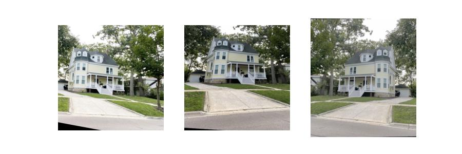
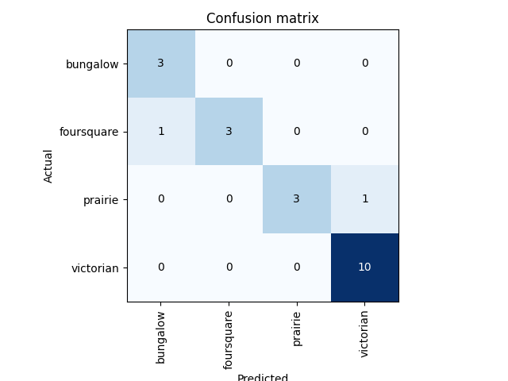
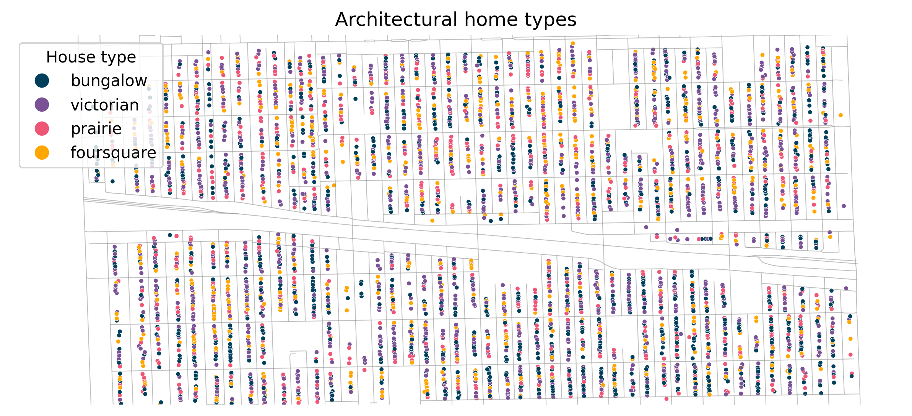
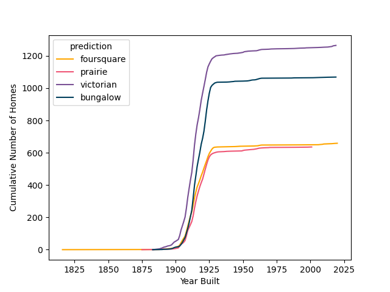
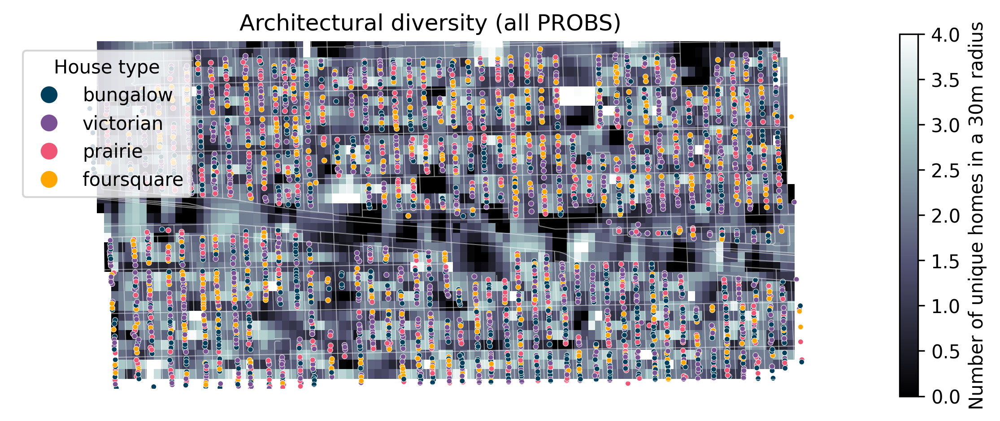
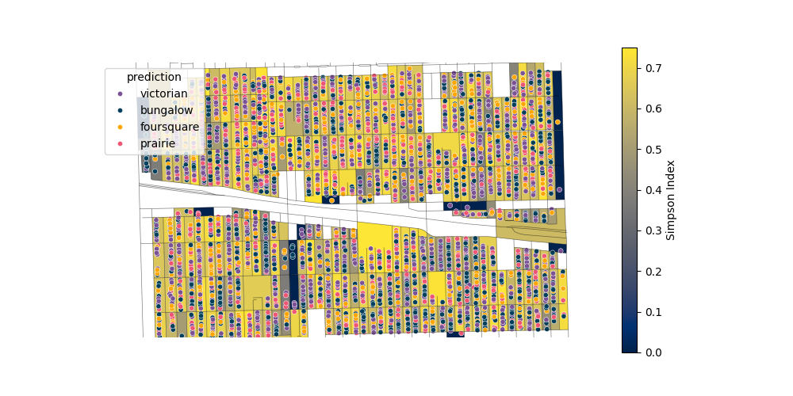
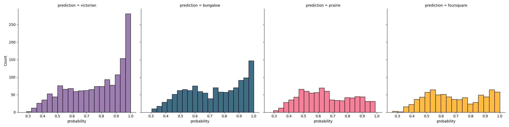
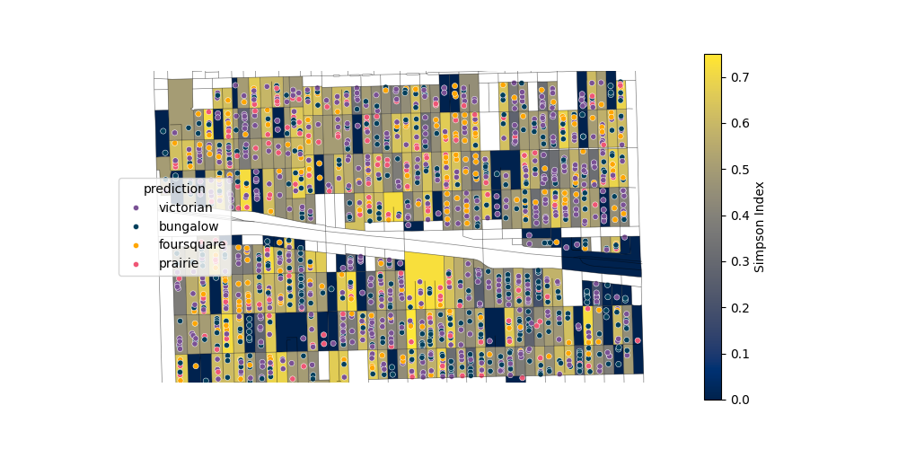
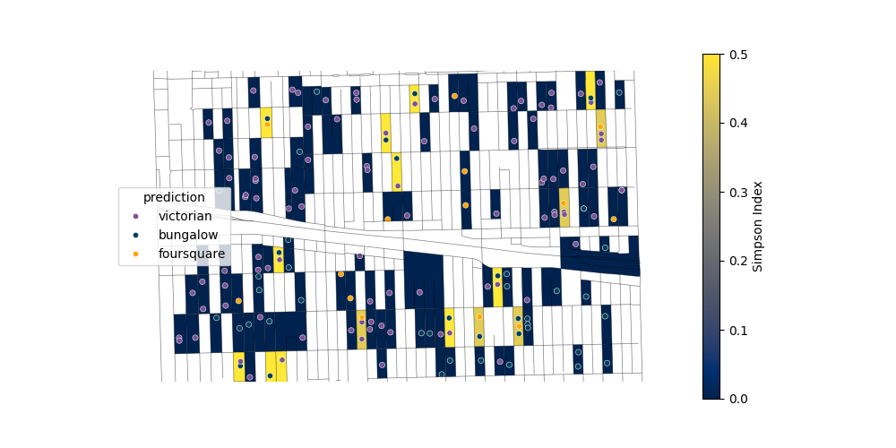

# ArchiMap: classifying and mapping architectural diversity of homes

<!-- ## Table of contents
- [Introduction](#introduction)
    - [Motivation](#motivation)
    - [Objective of the project](#objective-of-the-project)
    - [How this project differs from other work](#how-this-project-differs-from-other-work)
- [Scraping home images from real estate websites](#scraping-home-images-from-real-estate-websites)
- [Training the model](#training-the-model)
- [Model results](#model-results)
- [Feature engineering](#feature-engineering)
- [Visualizing architectural variation](#visualizing-architectural-variation)
    - [Home types across space](#home-types-across-space)
    - [Homes types across time](#homes-types-across-time)
    - [Adding diversity layers](#adding-diversity-layers)
- [Modeling home values](#modeling-home-values)
- [Building a recommendation engine](#building-a-recommendation-engine)
- [Future directions and insights](#future-directions-and-insights)
- [References](#references)
- [License](#license)
- [Author](#author) -->

@import "[TOC]" {cmd="toc" depthFrom=1 depthTo=6 orderedList=false}

## Summary

I trained a convolutional neural network (CNN) model to classify home types from images and then mapped the predicted home types across space. I found that home types are clearly related to the latitude and longitude of a home, and that there is a strong relationship between home types and home value. To predict home prices, I next trained a multiple linear regression and then predict prices on a test set. The root mean squared error (RMSE) was $90,551.92, meaning that, on average, the model was off by $90,551.92 in its prediction of home values. Since the average home price in the data set was $437,327.81, this means that the model was off by about 21% on average. Importantly, the model including home type was 7x better than a simpler model without this feature.

## Motivation
I have been interested in architecture since I moved to Oak Park back in 2017. Frank Lloyd Wright's home (see below) is close to my house and the diverse styles of homes in the area is incredible. While real estate websites like Redfin and Zillow often have ways to filter by number of bedrooms, bathrooms, or cost, something I have not been able to find is a map of architectural diversity by street block. I think that being able to view the diversity of homes in an area you're interested in prior to moving there would be a plus and could benefit real estate companies as well.

<!-- Idea with this project is to classify architecture type from an image of a home

- maybe look at geographic trends in home type?
- not sure exactly.

 -->

## Objectives
Modeling home values is important in automated valuation models (AVMs). Many of these models (e.g., Vo 2014, https://api.semanticscholar.org/CorpusID:150650431) include building features (square footage, lot size, number of bedrooms) and geographical features (latitude, longitude) of individual homes, but not architectural style or coalescent features (e.g., architectural cohesion of a neighborhood or block). The goals of this project are to:
1. evaluate whether home types can be automatically predicted from images using convoluational neural network (CNN) models,
2. test if architectural diversity is an important predictor of home values, and 
3. design a recommendation engine for users to search on distinct home styles or architectural cohesion of a neighborhood

### How this project differs from other work
Other researchers have been interested in classifying home architectural types from photos. My project is unique in that it scrapes photos from an area, predicts architectural type, and then employs GIS tools for mapping architectural diversity.

Now onto the fun stuff!

## Predicting home types from images

### Scraping home images from real estate websites
I decided to use Redfin for this project because the website was easily navigable. I obtained over 5000 images for testing. One challenge was that Redfin images were often obscured by trees. In these cases, the probilities were often very low, therefore I removed them from the subsequent visualizations and analyses.

### Training the convolutional neural network (CNN) model
To train the `resnet-34` deep learning image classification model I used the `fastAI` package which is built on the `pyTorch` framework. To train the model, I first obtained 65 home images (52 in the "training" dataset and 13 in the "validation" set) and classified them manually. I only included four home styles:
<!-- Here are the types we're are using for classification: -->
1. prairie-style (prairie)
2. Queen Anne victorian (victorian)
3. Chicago bungalow (bungalow)
4. American foursquare (foursquare)

I also obtained an additional image dataset with ~5000 home images classified into 25 different types. I filtered these down to be in line with the 4 styles I focused on above. I compared the small and expanded data sets in terms of model performance (see below).

 <!-- "American craftsman style", "American Foursquare", "Queen Anne", and "Colonial" types of architecture. This lowered the number of images from XX to XX. -->

Many houses were photographed at weird angles, obscured by trees, or in bad lighting. To account for this, I can use augmentation - that is, warp, transform, skew, change lighting/contrast of images prior to training. This way, when we run the model on real images we can potentially have better results. <!--This has been shown for cases like X and Y.--> Below are some examples of transformations done on a house image.

### Model results
Overall the model did pretty well, predicting 85% home types correctly in the validation data set. The confusion matrix below shows how actual home types (validated by a human, me in this case) match up with predicted home types.

Here are some examples of homes in the validation set classified correctly (green) and incorrectly (red, with predicted type on top and actual type below).

## Feature engineering
- __Alpha diversity__: I borrowed from the field of Ecology to define architectural diversity as the 'alpha' diversity, that is, the number of distinct home types in a given radius
- __Latitude and longitude__ may also predict home values and architectural styles.
- Home density <!--(exclusion principal? is architectural diversity a result of builders building different home styles or random?) -->
- __Simpson index__: The inverse Simpson index is a measure of diversity. For an area that has only two types of objects (say bungalow homes and victorian homes), then the index ranges from 0 (all homes of the same type) to 0.5 (the case where homes are split evenly into 50% bungalow and 50% victorian)
- Other features (home value, year built) were taken from the Redfin scraped data.

## Visualizing architectural variation

### Home types across space
Using this model, I can then predict the types of homes in a given area. Here is a preliminary result showing the types of homes. Different types of homes are shown as different circle colors. You'll notice that there is an obvious break in the middle of the map that corresponds to a major highway running through the area. Other gaps probably correspond to parks or recreational areas.

### Homes types across time
The buildup of the current architectural diversity is clearly not static, as these homes were built over time, with a boom in home-building in the "roaring twenties." Using the predictions output by the neural network, we can look at cumluative buildup of different home styles. Below is a plot showing the cumulative number of homes by year for a given house style. We can also visualize this as an animated GIF (check it out [here](simple_animation.gif)).

### Adding diversity layers
Instead of seeing the actual types of homes predicted by the model, we might want to see how the _diversity_ of homes changes across the town. Are there some areas with more architectural variety that would be exciting to live in?

To accomplish this, what we'll need to do is, for each home, determine the nearby homes and sum up the number of unique home types in that radius. Then, using an interpolation algorithm in the `scipi.interpolate` Python module, we can map this diversity variable across space. Here is the outcome of the process, with background shaded colors correspond to the architectural diversity of nearby homes (i.e., in a 20m radius).

<!--  -->

In the map above, you can see that there are several (n=1608) homes predicted as "prairie" style. This might be an artifact of the model, as this style was often confused with other classes. Looking closer at the probabilities (below), we see that the model is less confident in its prediction of prairie and victorian style homes as compared to bungalows (which are primarily >90% in probability levels).

Here is another map with only homes having probabilities great than 80%:

And we can be even more strict and only look at homes with 99% confidence in assigning them to a specific architectural type:

The plot is noticeably more "patchy" as expected. But the general trend of uneven architectural diversity still remains. We will use this metric later in our regression models of home values.

## Modeling home values
To understand trends in home values, I used the Redfin last sale price home values in a model with geographic features (latitude, longitude) as well as home type. Below are the results of a linear regression model trained on 3607 data points (homes with price values available). This model was highly significant (P < 0.001) with a Pearson's correlation coefficient _r_ = -0.15. This indicates that, as we get further from the Chicago city center (i.e., West), home values increase.

As an alternative analysis, I also trained a random forest regressor model (80-20 random train-test split) that gave an $\text{R}^2$ = 0.57, meaning that 57% of variation in home values can be explained by a subset of features (latitude, longitude, home type, Simpson index, square footage, yard size, number of bedrooms, number of bathrooms, and the year built).

The root mean squared error (RMSE) was $90,551.92, meaning that, on average, the model was off by $90,551.92 in its prediction of home values. Since the average home price in the data set was $437,327.81, this means that the model was off by about 21% on average.

Taking the log-likelihoods of the full model and comparing it to a simpler model without home type, we see that the full model is 7x better than a simpler model without this feature.

## Building a recommendation engine
Coming soon...

## Future directions and insights
- Test the model with more homes and on different localized data sets to see how well the model performs with different geographic styles in a given architectural type (e.g., California versus Chicago craftsman/bungalow homes)
- Add a layer of home types could allow a user to take a look at how architecturally interesting an area is
- Build a webapp where a person can type in a type of home they are interested in and see a density map of that home across a geographic region
- Include addition features (number of rooms, lot size, home square footage) in the regression models

## References
Software:
- FastAI (https://www.fast.ai)
- Redfin (https://www.redfin.com)

Data sets:
- Residential addresses from the Cook County website [here](https://www.cookcountyassessor.com/ajax/clarity_pin_search/next?provider=neighborhood&town=Oak+Park&town_id=27&neighborhoodCode=100&classification=none&pages=43&page=25&_wrapper_format=drupal_ajax).
- House image database used for training models ([article link](https://link.springer.com/chapter/10.1007/978-3-319-10590-1_39)).

Images/architectural advice:
- prairie style source images - https://www.localarchitecturechicago.com/index.php/2019/09/13/prairie-architecture-in-chicagos-beverly-and-morgan-park-neighborhoods-1904-1925/
- bungalow source images - https://www.chicagobungalow.org/chicago-bungalow
- general house architecture - https://www.oldhouses.com/styleguide

## License
This project is licensed under the MIT License.

## Author
Chad M. Eliason  
Field Museum
