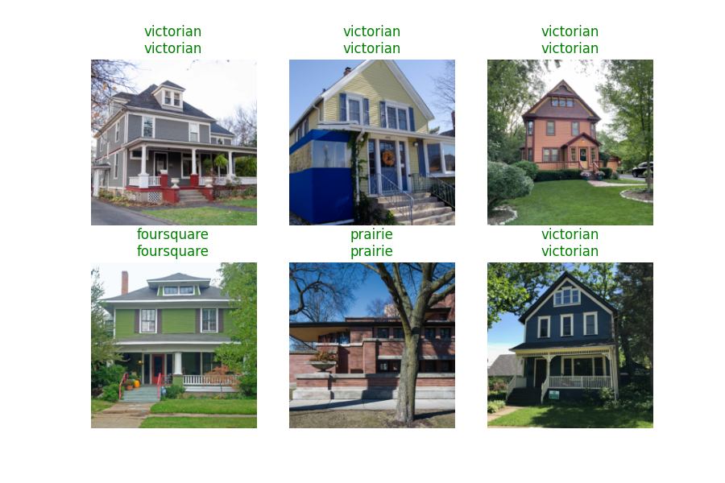
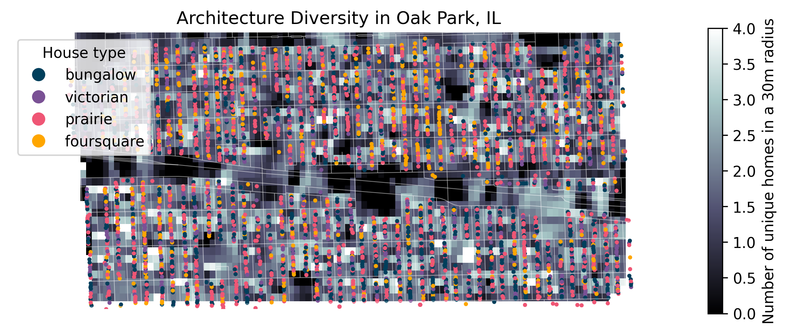

# ArchiMap: classifying and mapping architectural diversity of homes

## Table of contents
- [Motivation](#motivation)
- [Scraping home images from real estate websites](#scraping-home-images-from-real-estate-websites)
- [Training the model](#training-the-model)
- [Model results](#model-results)
- [Mapping architectural diversity layers](#mapping-architectural-diversity-layers)
- [How this differs from previous work](#how-this-differs-from-previous-work)
- [Future directions and insights](#future-directions-and-insights)
- [References](#references)
- [License](#license)
- [Author](#author)

## Motivation
I have been interested in architecture since I moved to Oak Park back in 2017. Frank Lloyd Wright's home (see below) is close to my house and the diverse styles of homes in the area is incredible. While real estate websites like Redfin and Zillow often have ways to filter by number of bedrooms, bathrooms, or cost, something I have not been able to find is a map of architectural diversity by street block. I think that being able to view the diversity of homes in an area you're interested in prior to moving there would be a plus and could benefit real estate companies as well.

<!-- Idea with this project is to classify architecture type from an image of a home

- maybe look at geographic trends in home type?
- not sure exactly.

 -->

## Scraping home images from real estate websites
I decided to use Redfin for this project because the website was easily navigable. I obtained over 5000 images for testing. One challenge was that Redfin images were often obscured by trees. In these cases, the probilities were often very low, therefore I removed them from the subsequent visualizations and analyses.

## Training the model
To train the `resnet-34` deep learning image classification model (REF) I used the `fastAI` package which is built on the `pyTorch` framework. To train the model, I first obtained 65 home images (52 in the "training" dataset and 13 in the "validation" set) and classified them manually. I only included four home styles:
<!-- Here are the types we're are using for classification: -->
1. prairie-style (prairie)
2. Queen Anne victorian (victorian)
3. Chicago bungalow (bungalow)
4. American foursquare (foursquare)

I also obtained an additional image dataset with ~5000 home images classified into 25 different types. I filtered these down to be in line with the 4 styles I focused on above. I compared the small and expanded data sets in terms of model performance (see below).

 <!-- "American craftsman style", "American Foursquare", "Queen Anne", and "Colonial" types of architecture. This lowered the number of images from XX to XX. -->

Many houses were photographed at weird angles, obscured by trees, or in bad lighting. To account for this, I can use augmentation - that is, warp, transform, skew, change lighting/contrast of images prior to training. This way, when we run the model on real images we can potentially have better results. This has been shown for cases like X and Y. Below are some examples of transformations done on a house image.

## Model results
Overall the model did pretty well, predicting 85% home types correctly in the validation data set. The confusion matrix below shows how actual home types (validated by a human, me in this case) match up with predicted home types.

Here are some examples of homes in the "validation" set classified correctly (green) and incorrectly (red, with predicted type on top and actual type below).

## Mapping architectural diversity layers
Using this model, I can then predict the types of homes in a given area, Oak Park, IL in my case. Here is a preliminary result showing the types of homes. Different types of homes are shown as different circle colors. The background shaded colors correspond to the architectural diversity of nearby homes (i.e., in a 20m radius).

<!-- TODO: discuss more the way I did this, what types of approaches for kernel smoothing, etc.

Maybe convert from lat/long to meters? or feet? or blocks??? that would be cool..

 -->

In the map above, you can see that there 1608 homes predicted as "prairie" style. This might be an artifact of the model, as this style was often confused with other classes.

Looking closer at the probabilities (below), we see that the model is less confident in its prediction of prairie and victorian style homes as compared to bungalows (which are primarily >90% in probability levels).

## How this differs from previous work
Other researchers have been interested in classifying home architectural types from photos. My project is unique in that it scrapes photos from an area, predicts architectural type, and then employs GIS tools for mapping architectural diversity.

## Future directions and insights
- Test the model with more homes and on different localized data sets to see how well the model performs with different geographic styles in a given architectural type (e.g., California versus Chicago craftsman/bungalow homes)
- Add a layer of home types could allow a user to take a look at how architecturally interesting an area is
- Build a webapp where a person can type in a type of home they are interested in and see a density map of that home across a geographic region

## References
Software:
- FastAI (https://www.fast.ai)
- Redfin (https://www.redfin.com)

Data sets:
- Residential addresses from the Cook County website [here](https://www.cookcountyassessor.com/ajax/clarity_pin_search/next?provider=neighborhood&town=Oak+Park&town_id=27&neighborhoodCode=100&classification=none&pages=43&page=25&_wrapper_format=drupal_ajax).
- House image database used for training models ([article link](https://link.springer.com/chapter/10.1007/978-3-319-10590-1_39)).

Images/architectural advice:
- prairie style source images - https://www.localarchitecturechicago.com/index.php/2019/09/13/prairie-architecture-in-chicagos-beverly-and-morgan-park-neighborhoods-1904-1925/
- bungalow source images - https://www.chicagobungalow.org/chicago-bungalow
- general house architecture - https://www.oldhouses.com/styleguide

## License
This project is licensed under the MIT License.

## Author
Chad M. Eliason  
Field Museum
